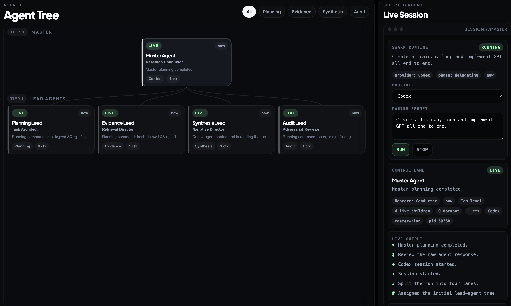

# Agent Tree Viewer

Minimal Electron desktop console for visualizing a master/subagent research tree.

The app opens into an empty workspace, lets you add a master agent manually, and then lets the master create subagents automatically or lets you add them yourself. Active sessions write compact shared context into a persistent store so downstream agents can reuse findings without pulling full codebase state into every chat.

## Screenshot



## What ships in the npm package

- Electron main process and preload bridge
- Minimal tree UI and terminal-style session inspector
- File-backed shared context store
- Codex and Claude runtime switching

Python training files, local experiment outputs, notebooks, and test artifacts are intentionally excluded from the published package.

## Install

```bash
npm install agent-tree-viewer
```

## Run

Use the packaged launcher:

```bash
npx agent-tree-viewer
```

Or if you are developing inside the repo:

```bash
npm install
npm start
```

## Development checks

```bash
npm run check
npm run pack:check
```

## Runtime notes

- The desktop app stores state in Electron's user-data directory.
- `codex` and `claude` are detected from your `PATH`.
- Only active agents render in the tree.
- Shared context entries are intentionally compact: findings, symbols, references, and outcomes.

## Package contents

The npm tarball is whitelisted to:

- `bin/`
- `electron/`
- `shared/`
- `ui/`
- `README.md`
- `LICENSE`

## License

MIT
