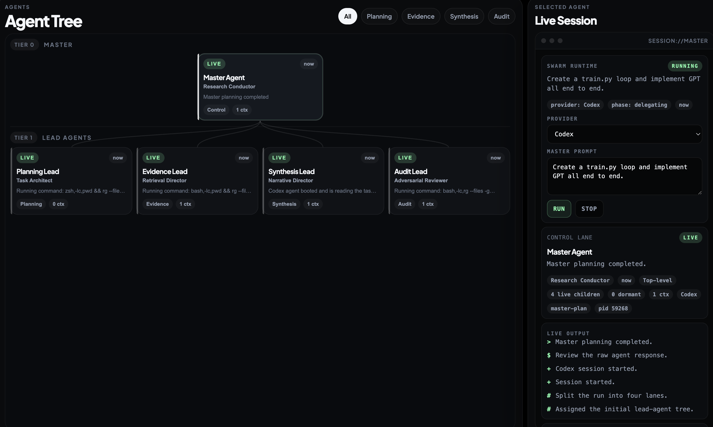
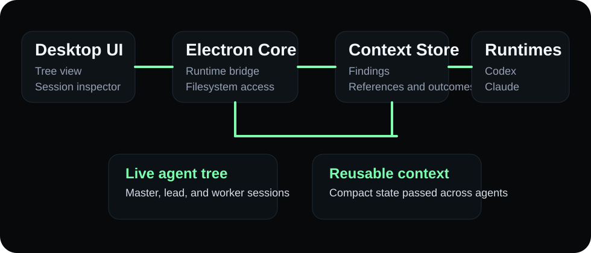

# Agent Tree

Agent Tree is a Luxen desktop workspace for running master and subagent sessions with shared context, live status, and one place to inspect the tree as work branches out.

It is built for multi-agent coding and research workflows where context needs to stay compact and reusable instead of being recopied into every chat.





## What it does

- Renders the live master, lead, and worker tree
- Persists shared context entries that downstream agents can reference
- Switches between Codex and Claude at runtime
- Shows per-agent lane, status, and recent updates in one desktop view
- Keeps the control surface local with no hosted backend

## How it works

- `electron/` owns runtime integration, filesystem access, and the shared context store
- `ui/` renders the tree, lane filters, and selected session inspector
- `shared/default-state.json` provides a clean development state for local runs
- `bin/agent-tree.js` launches the packaged app

## Run from source

```bash
npm install agent-tree-viewer
npx agent-tree-viewer
```

## Development checks

```bash
npm run check
npm run pack:check
```

## Runtime notes

- The desktop app stores state in Electron's user-data directory
- Only active agents render in the tree
- Shared context entries stay intentionally compact and focus on findings, symbols, references, and outcomes

## Authorship

Agent Tree is a Luxen project. This public repo reflects implementation work by Ganesh Talluri and Ishaan Ranjan.

## License

MIT
